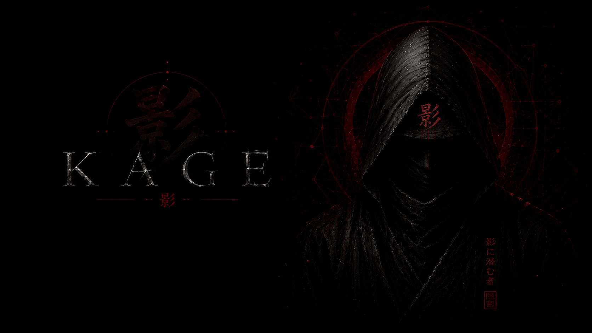

# Kage <sub>影</sub>

<p align="center">
  
</p>

> 影に潜む

Shellcode loader using indirect syscalls. Self-injection, FreshyCalls SSN extraction, random gadget pool, callstack spoofing, per-build XOR key, jitter. Windowless.

## Why Zig

Zig's build system handles everything: random XOR key generation, comptime shellcode encryption, cross-compilation. One command, no external tools needed. No CRT linked, minimal import table.

```bash
zig build -Dtarget=x86_64-windows-gnu -Doptimize=ReleaseFast
# → zig-out/bin/kage.exe
```

## 仕掛け

- **影探し** — ntdll via PEB walk (`gs:[0x60]`)
- **闇渡り** — indirect syscall dispatch (64 random gadgets)
- **血判** — FreshyCalls SSN extraction (sorted export RVA, immune to inline hooks)
- **封印** — comptime shellcode XOR with per-build 128-bit random key
- **影纏い** — XOR-encoded asm dispatch globals + callstack spoofing

For evasion use [Valak](https://git.churchofmalware.org/JYenn/valak).

## Layout

```
src/
├── main.zig       entry, unified syscall dispatch
├── nt.zig         NT pseudo-handles not in stdlib
├── pe.zig         PE parser, export resolver, section headers
├── syscall.zig    PEB walk, FreshyCalls table, gadget pool, PRNG
├── hells_gate.s   asm dispatch (XOR globals, stack spoof)
build.zig
```

## License

MIT
